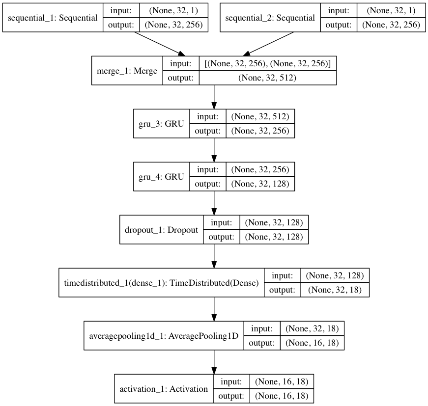

# Rorschach

[](https://travis-ci.com/OptimusCrime/master-thesis-code)

Code behind master thesis for Thomas Gautvedt.

## Information

This project attempts to do letter classificaion in a small search space by using technologies most commonly found in Natural Language Processing.

We do this by building a network that uses a lot of recurrent components, that are able to do sequence to sequence prediction.

The network looks like this:



## Install

This project requires [Python3](https://www.python.org).

### Unix / macOS X

#### Unix prerequisite

```bash
apt-get install build-essential gfortran libatlas-base-dev python3 python3-dev
```

#### macOS X prerequisite

Unknown

Install [Homebrew](http://brew.sh).

#### Common prerequisite

```bash
pip install virtualenv virtualenvwrapper
```

Create a new virtualenv with Python3 and activate it.

#### Project dependencies

Run the setup script with `sh setup_unix.sh`. On Linux we attempt to install graphviz using apt-get, this requires root. On macOS X we attempt to install graphviz with brew.

Note: If you'd like GPU support in Tensorflow, you need to uninstall the version installed with the shell script. Instead you need to install the GPU version. This requires CUDA toolkit 8.0 and CuDNN v5.

### Windows

Not supported yet.

## Setup

You'll need a few more things before you can get the project up and running.

### Download Arial.tff

TODO

### Download a wordlist

TODO
